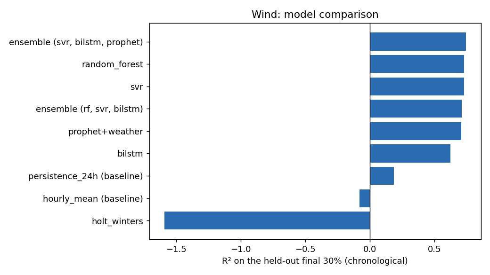
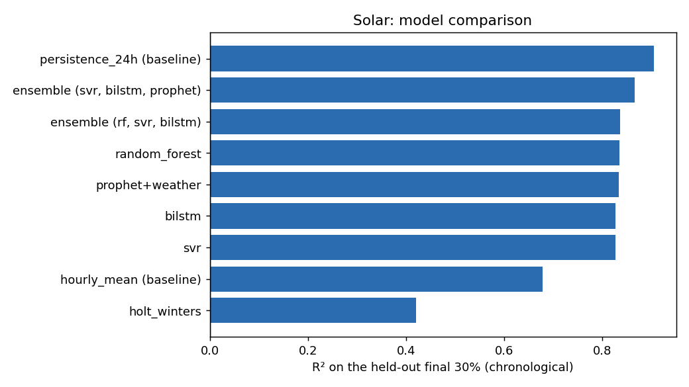

# Renewable energy production forecasting (France, wind and solar)

Hourly wind and solar production for the French grid, modelled from NASA POWER weather data, with a tested pipeline, an
honest comparison of baselines, statistical, machine-learning and deep-learning models, and a small API that serves the best weather-driven model.

It started as my MSc Data Analytics dissertation (University of Strathclyde, 2024). In 2026 I audited the original
notebook, found it did not support its own conclusions, and rebuilt it here. The audit is part of the project: see
[What changed from the dissertation](#what-changed-from-the-dissertation).

**What the model is, and is not.** It maps the weather in a given hour to production in that hour. It does not forecast
the weather. To produce a forecast, feed it forecast weather values (for example from a numerical weather prediction).
The scores below use observed (reanalysis) weather, so they are an upper bound on forecast performance.

## Results

All models are scored on the same held-out final 30% of the series (7,947 hours, from August 2022), trained on the
earliest 70% (18,543 hours). Nothing is shuffled. R² is the share of hourly variance explained.

### Wind

| Model | RMSE (MWh) | MAE (MWh) | R² |
| --- | ---: | ---: | ---: |
| ensemble (svr, bilstm, prophet) | 1,952 | 1,470 | 0.742 |
| random_forest | 1,995 | 1,491 | 0.730 |
| svr | 2,004 | 1,498 | 0.728 |
| ensemble (rf, svr, bilstm) | 2,062 | 1,525 | 0.712 |
| prophet+weather | 2,084 | 1,660 | 0.706 |
| bilstm | 2,359 | 1,715 | 0.623 |
| persistence_24h (baseline) | 3,465 | 2,539 | 0.186 |
| hourly_mean (baseline) | 3,995 | 2,980 | -0.082 |
| holt_winters | 6,186 | 4,858 | -1.594 |

### Solar

| Model | RMSE (MWh) | MAE (MWh) | R² |
| --- | ---: | ---: | ---: |
| persistence_24h (baseline) | 561 | 265 | 0.905 |
| ensemble (svr, bilstm, prophet) | 666 | 464 | 0.867 |
| ensemble (rf, svr, bilstm) | 736 | 399 | 0.837 |
| random_forest | 740 | 385 | 0.835 |
| prophet+weather | 745 | 668 | 0.833 |
| bilstm | 758 | 452 | 0.827 |
| svr | 759 | 400 | 0.827 |
| hourly_mean (baseline) | 1,035 | 602 | 0.678 |
| holt_winters | 1,387 | 856 | 0.421 |




### What the numbers say

1. **Wind: weather matters a lot.** Weather-driven models reach R² of about 0.73, against 0.19 for "same hour yesterday".
   The best result is the SVR, BiLSTM and Prophet ensemble (0.742),
   only a little above a plain Random Forest (0.730).
2. **Solar: yesterday beats every weather model.** Solar output follows the daily cycle so closely that "same hour
   yesterday" scores 0.905, above the best weather model
   (0.867). Weather alone is not enough here; the natural next
   step is a model that uses both weather and lagged production.
3. **The evaluation protocol changes the answer.** On a random shuffle of hourly rows (the dissertation's protocol),
   Random Forest scores 0.766 for wind and 0.899
   for solar. On a chronological split it scores 0.730 and
   0.835. Shuffled splits flatter the model because neighbouring hours leak across the split.
4. **Timestamp alignment changes it more for solar.** Rebuilding timestamps from `Date` and `StartHour` drops the UTC
   offset. With that error, Random Forest solar R² on the chronological split is 0.651;
   with timezone-aware timestamps it is 0.835. Wind barely moves
   (0.718 to 0.730).
   See [`results/alignment_check.csv`](results/alignment_check.csv).

## What changed from the dissertation

The dissertation reported a best R² of about 0.75 to 0.76 and concluded that a weighted ensemble was the best wind model.
Reading the original notebook's code and saved outputs showed that those tables cannot be reproduced from it, and found four problems, all fixed here:

1. The **Solar Random Forest cell used the wind data**, so the reported solar Random Forest row was the wind result repeated.
2. Production timestamps ignored the **UTC offset**, misaligning production and weather by one to two hours.
3. Models were scored on **different protocols** (shuffled split for Random Forest, SVR and ARIMA; chronological for LSTM and Prophet).
4. **Holt-Winters used an additive trend** extrapolated over the whole test period, which diverges. This version uses seasonality only.

I also dropped ARIMA, which was fitted to shuffled data and then asked for a long multi-step forecast. The original
notebook is kept, with outputs cleared and a warning banner, in [`notebooks/`](notebooks/original_dissertation_notebook.ipynb).

## Run it

Use `python3` to create the environment. Once it is activated, `python` also works.

```bash
python3 -m venv .venv
source .venv/bin/activate
pip install -r requirements.txt
python -m pytest -q
```

Download the production CSV first (see [`data/README.md`](data/README.md)) and save it as
`data/raw/intermittent-renewables-production-france.csv`. Then:

```bash
export PYTHONPATH=src
python -m scripts.run_experiments --production data/raw/intermittent-renewables-production-france.csv
python -m scripts.train_final --production data/raw/intermittent-renewables-production-france.csv
```

`run_experiments` rewrites `results/` (about 3 minutes on a laptop CPU). `train_final` picks the better of Random Forest
and SVR per source on the chronological hold-out and refits it on all data into `artifacts/`.

## API

```bash
export PYTHONPATH=src
uvicorn app.main:app --reload
```

Interactive docs are at http://localhost:8000/docs.

```bash
curl -X POST http://localhost:8000/predict -H "Content-Type: application/json" -d '{
  "source": "solar",
  "weather": {"ALLSKY_SFC_SW_DWN": 650, "ALLSKY_SFC_SW_DNI": 720, "ALLSKY_SFC_SW_DIFF": 110, "T2M": 24, "WS10M": 4}
}'
# {"source":"solar","predicted_mwh":3849.7,"model":"random_forest"}
```

| Endpoint | What it does |
| --- | --- |
| `POST /predict` | Estimated MWh for `wind` or `solar` from five weather values. Out-of-range inputs return 422. |
| `GET /model-info` | The model serving each source and its held-out scores. |
| `GET /health` | Liveness check. |

### Deploy

- **Docker:** `docker build -t renewable-api . && docker run -p 8000:8000 renewable-api` (the Dockerfile has not yet been built on my machine; the first Render build is its first test)
- **Render:** the included [`render.yaml`](render.yaml) is a Blueprint. Connect the repo in Render and it builds the Dockerfile on the free tier.

## Layout

```
src/renewables/   data loading and alignment, models, evaluation helpers
scripts/          run_experiments.py (all models), train_final.py (serving models)
app/              FastAPI service
tests/            data alignment, splits, API validation (16 tests)
results/          metrics.csv, alignment_check.csv, figures
artifacts/        trained serving models and model_info.json
notebooks/        the original dissertation notebook, kept for transparency
data/             weather CSV and notes on the production data
```

## Limitations

- **One weather point.** All weather comes from a single central point in France (47.27 N, 2.36 E), because the production
  data does not say where the plants are. National output depends on weather across the whole country.
- **Observed, not forecast, weather.** Real forecast errors would lower these scores.
- **Single hold-out split.** There are no confidence intervals or rolling-origin evaluation yet.
- **Hyperparameters reused.** Random Forest and SVR settings come from the dissertation's grid search and were not re-tuned
  under the chronological split. The BiLSTM architecture is fixed and the ensembles are plain averages.
- **No lagged production features,** which matters most for solar (see result 2).

## Next steps

Add lagged production and weather-forecast lags, evaluate with rolling-origin splits, use regional weather, and add
prediction intervals.

## Data and licence

Weather: [NASA POWER](https://power.larc.nasa.gov/). Production: Kaggle, [Wind and Solar Daily Power Production](https://www.kaggle.com/datasets/henriupton/wind-solar-electricity-production)
(not redistributed; see [`data/README.md`](data/README.md)). Code is MIT licensed; see [`LICENSE`](LICENSE).
